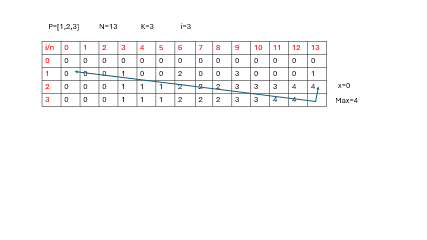
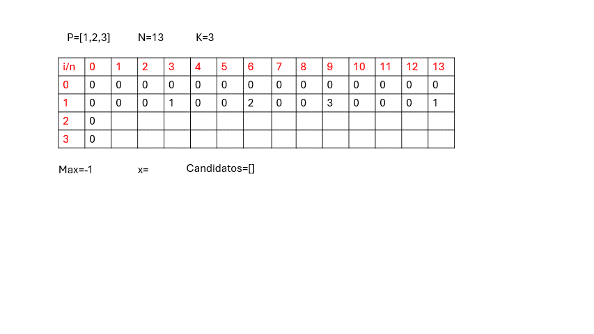
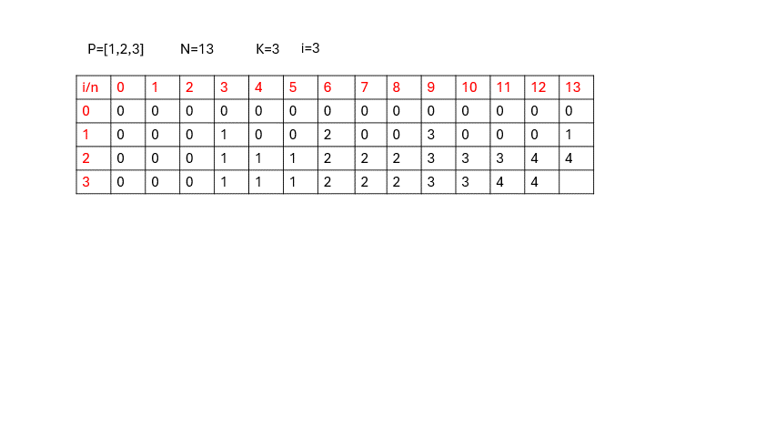
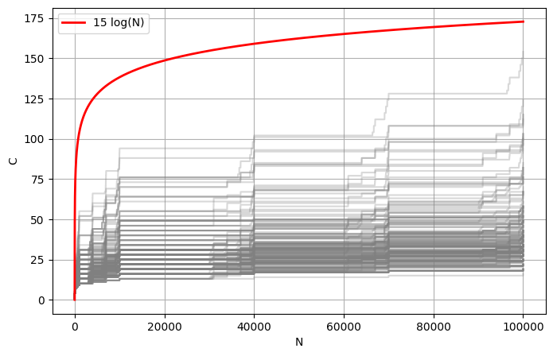

<picture>
    <source srcset="https://imgur.com/5RiEY87.png" media="(prefers-color-scheme: dark)">
    <source srcset="https://imgur.com/5RiEY87.png" media="(prefers-color-scheme: light)">
    
</picture>

<h3>ISIS 1105 Diseño y Análisis de Algoritmos</h3>

<h1>Proyecto Parte 1 - Máxima Creatividad</h1>

<h5>Daniel Santiago Muñoz 
    Juan David Ortiz 

<h6>Universidad de los Andes 
    2025-II</h6>

# Algoritmo 1 
Este algoritmo busca guardar la maxima creatividad de usar $i$ celdas y repartir $n$ energía. 

$$
dp[i][n] =
\begin{cases}
0 & \text{si } i=0 \lor n=0, \\
\text{creativity}(n) & \text{si } i=1, \\
\max\limits_{0 \leq x \leq n} \big(dp[i][n],\ dp[i-1][n-x] + dp[1][x] \big) & \text{si } i > 1 \land n>0.
\end{cases}
$$

**Donde:**

- $dp[i][n]$ es la máxima creatividad al llenar hasta la $i$-ésima celda usando un total de $n$ unidades de energía.  
- $\text{creativity}(n)$ es la creatividad generada al colocar $n$ unidades de energía en una sola celda.  

**Principios clave:**
1. El orden en que se llenan las celdas no afecta el resultado.  
2. La creatividad depende únicamente de la cantidad de energía asignada a una celda, y no de cuál celda específica se trate.

La idea detras del algoritmo es que para tener la máxima cantidad de creatividad en $k$ celdas con $N$ energía, se puede conseguir hallando la máxima cantidad de energia entre repartir $N-x$ energía en $k-1$ celdas más repartir en **1** celda, $x$ energía. Esto puede empezarse desde $i=1$ haciendo una matriz con caso base $n=0 \lor i=0$ hasta  $k$ con una matriz.

A contnuación se presenta un ejemplo:

## Complejidad
Notese que en el ejemplo anterior, se recorrieron todos los valores de $n$ para hallar la creatividad máxima de $n=13$. Ya que este proceso se debe hacer para cada valor de $n$, entonces esta complejidad seria de $O(n^2)$. Ademas de esto, se realiza por cada celda, por tanto la complejidad final es de:

$$
O(kn^2)
$$

## Optimización
Al realizar la tabla, vemos que muchos valores son 0, o sencillamente se repiten. Para evitar estos valores proponemos guardar una lista de _candidatos_ En los cuales solo se guardan solo los valores únicos de creatividad posibles y además, mayores a los anteriores. En otras palabras hacemos un arreglo monotonamente creciente.

Para llenar este arreglo, sencillamente emepzamos con un indicador -1, y para cada $0 \le i\le n$ lo agregamos si su creatividad es mayor al indicador. Luego el indicador se actualiza con este valor. Esto tiene una complejidad de $O(N)$

El proceso se ve a continuación.

Luego solo realizamos la iteracion en estos valores.

Por lo que la complejidad final es de

$$
    O(kNC)
$$

### Hallar la cota de $C$

A continuación mostramos una gráfica mostrando el tamaño de $C$ contra diferentes valores de N para 200 combinaciones de peso diferentes.

Como podemos observar, el tamaño parece estar acotado por una funcion $\log_{10} N$, lo cual implica que $C = O(\log N)$

Lo que hace que la complejidad final sea de

$$O(kN\log N)$$

## Inconvenientes
A primera vista esto mejora la velocidad, pero haciendo pruebas muestra que el algoritmo no siempre funciona.
Para ver que tan correcto es el algoritmo, se realizan 10 iteraciones de pesos diferentes. Como se realiza la tabla segun la definicion iterativa, entonces hallar $dp[k][N]$ tambien implica hallar y guardar $d[i][m], \quad 0 \le i \le k, \; 0 \le m \le n$. Debido a que los casos bases son iguales para ambos metodos, para hallar el porcentaje de correctidud tomamos desde $i=2 \ m=3$ con un valor de $k=1000$ y $N=1000$. Estos fueron los resultados:

$$
\texttt{Porcentaje de coincidencia: 99.99\%} \\
\texttt{Cantidad de iguales: 9969062} \\
\texttt{Cantidad de Total: 9970020} \\
$$

# Algoritmo Greedy

Por cuestiones de complejidad temporal, proponemos un **tercer algoritmo Greedy**, rápido pero que no garantiza siempre la solución óptima.

La idea del algoritmo es la siguiente:

1. **Calcular la creatividad por unidad de energía**
   Para cada posible cantidad ( x ) de energía, se calcula:
   $$
   r(x) = \frac{\text{creatividad}(x)}{x}
   $$
   donde $\text{creatividad}(x)$ es la puntuación asociada a gastar (x) unidades de energía.

2. **Seleccionar la mejor relación creatividad/energía**
   Se escoge $x^*$ tal que:
   $$
   x^* = \arg\max_{x} r(x)
   $$

3. **Distribuir energía entre las (k) celdas**
   Se reparte $x^*$ unidades de energía en cada una de las $k$ celdas.
   Si sobra energía después de la distribución, se asigna a una celda sobrante o se añade a una celda existente.

Esto implica

* Maximiza el uso del número con mayor puntuación.
* Rapido: calcular $r(x)$ tiene complejidad **$O(n)$** y las operaciones adicionales son **$O(1)$**.
* Ideal para casos demasiado grandes donde los algoritmos exactos serían demasiado costosos.
* No garantiza siempre la solución óptima.
* Puede no cubrir todos los casos extremos donde una combinación distinta de energías proporcione mejor creatividad total.

# Justificación de Límites
En el programa se eligieron tres limites para definir que algoritmo usar. Los valores fueron elegidos como aproximaciones basadas en pruebas experimentales para equilibrar precisión y tiempo.

* **80 000 000** → usar **algoritmo exacto** cuando el coste temporal es viable.
* **100 000 000** → usar **algoritmo optimizado** cuando el coste exacto se vuelve inviable en el tiempo.
* Si ninguno de los anteriores cumple, se usa **algoritmo greedy** como última opción.

